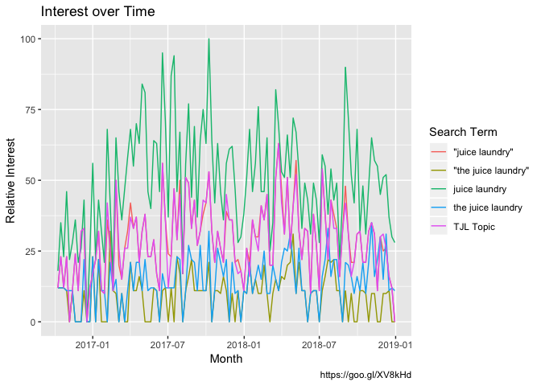
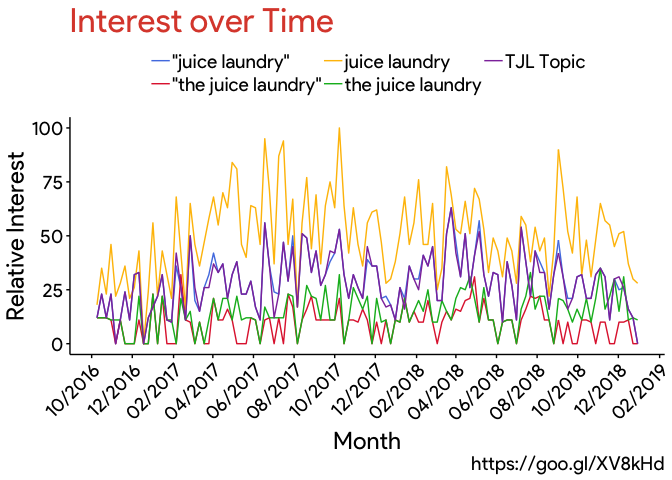
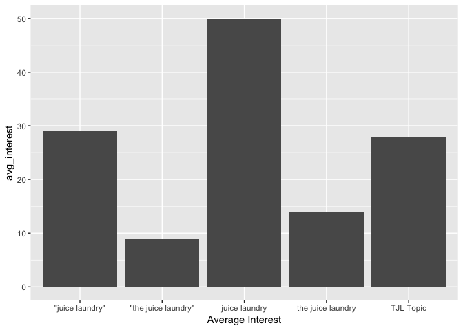
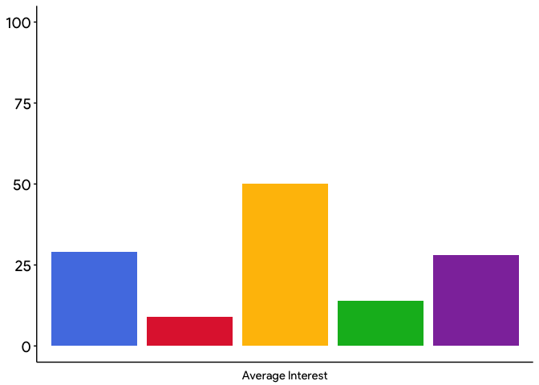
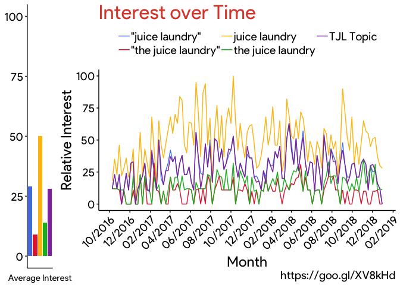
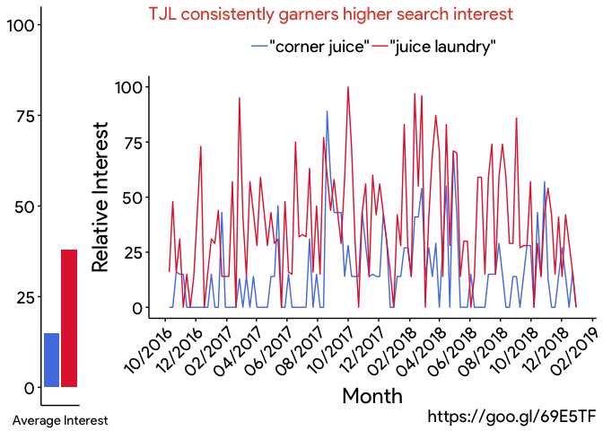

The Google Trends R Guide
================
A manual for *intelligent*, *reproducible*, and *programmatic* analysis of *Google Trends* search interest over time with the `gtrendsR` package

------------------------------------------------------------------------

### Table of Contents
-   [Overview](#overview)
-   [Understanding *Google Trends*](#understanding-google-trends)
-   [Navigating the User Interface (UI)](#navigating-the-user-interface-ui)
-   [Testing the `gtrendsR` package](#testing-the-gtrendsr-package)
-   [`get_gtrends_url` function](#get_gtrends_url-function)
-   [Replicating the UI](#replicating-the-ui)
-   [*TJL* search terms analysis](#tjl-search-terms-analysis)
-   [*Corner Juice* vs. *TJL*](#corner-juice-vs.-tjl)
-   [`thejuicelaundry` dataset](#thejuicelaundry-dataset)

------------------------------------------------------------------------

### Overview

First and foremost, you must understand what *Google Trends* is, how it retrieves data, what that data means, and what you can gain from it.

Then you can start to use it, first through the User Interface (UI) found <a href="https://trends.google.com/trends/?geo=US" target="blank">here</a> and later through the `gtrendsR` package.

The benefits of using an R package are numerous and will become more and more apparent throughout this guide. To summarize, an R package allows your analysis to be more *intelligent*, *reproducible*, and *programmatic*.

We will walk you through using Google Trends, pointing out some nuances along the way, and then we will show you how to generate the same exact data (and even the same visuals) with the `gtrendsR` package. We will apply everything to <a href="https://www.thejuicelaundry.com" target="blank">*The Juice Laundry*</a> (TJL), demonstrating methods to extract data that is most useful and most accurate, and comparing that data to local competition, namely *Corner Juice*.

------------------------------------------------------------------------

### Understanding *Google Trends*

According to the *Google Trends Help* page...

*Google Trends* data is an unbiased sample of Google search data:

-   Only a percentage of searches are used to compile Trends data.

-   Samples are refreshed every day and so data from one day with differ slightly from data (with the same parameters) from another.

Search results are proportionate to the time and location of a search (commonly referred to as a query) by the following process:

-   Each data point is divided by the total searches of the geography and time range it represents to compare relative popularity. Otherwise, places with the most search volume would always be ranked highest.

-   The resulting numbers (what I will refer to as `relative_interest`) are then scaled on a range of 0 to 100 based on a topic’s proportion to all searches on all topics.

-   Different regions that show the same search interest for a term don't always have the same total search volumes.

Some data is excluded:

-   Searches made by very few people: Trends only shows data for popular terms, so search terms with low volume appear as "0."

-   Duplicate searches: Trends eliminates repeated searches from the same person over a short period of time.

-   Special characters: Trends filters out queries with apostrophes and other special characters.

The uses for *Google Trends* are plentiful. As <a href="https://www.bruceclay.com/newsletter/volume120/why-use-google-trends.htm" target="blank">bruceclay.com</a> highlights...

-   Google Trends offers a multidimensional view of queries and how they have evolved as a result of factors like seasonality, geographic location, and media coverage.

-   Data provided as relative popularity over time – not total search volume – can provide an apples to apples idea of query popularity.

-   Graphed media coverage incidents help marketers see direct correlations between media coverage and spikes in interest.

Along the lines of what this guide will show you, *Google Trends* is most practical for *benchmarking against competitors* and *understanding emerging trends* for a business or an industry.

------------------------------------------------------------------------

### Navigating the User Interface (UI)

If you do not already have it open, go to <a href="https://trends.google.com/trends/?geo=US" target="blank">Google Trends</a>.

**<u>*Step 1:*</u>** Enter *"juice laundry"* (in quotes) as your search term. Then change *'Past 12 Months'* to a custom time range from October 9, 2016 (10-9-2016) to the end of 2018 (12-31-2018). These dates coincide with the time period of the `thejuicelaundry` package's *Square* transaction data.

Notice that you can also change the location, category, and search type (web, image, etc.) parameters, but leave them alone.

**<u>*Step 2:*</u>** Enter *"Juice Laundry"* (in quotes and capitalized this time) as a second search term.

Both terms should say *'search term'* under them. You will notice that only the red line shows. This is because the **search terms are case insensitive** and the trendlines are identical.

**<u>*Step 3:*</u>** Replace the second search term with *"the juice laundry"* (in quotes).

The resulting trendlines will be unique, displaying generally greater search interest for the search term without *"the"* (an additional restriction) in them -- which makes sense. Take note of how the interest over time for the existing trendline (the blue) shrinks as you add the new search term. Remember that this is because **search interest for one term is relative to the search interest for another**.

**<u>*Step 4:*</u>** Add *juice laundry* (not in quotes) and *the juice laundry* (not in quotes), in that order, as two more search terms.

You will notice that the trendlines are different and that is because the quotes around the terms creates a totally different query based on *Google's* algorithm. Navigate <a href="https://support.google.com/trends/answer/4359582?hl=en" target="blank">here</a> to see the results of queries that are different but that share similar terms. The takeaway is that **the algorithm is stricter on quoted terms** (because it only counts searches with that exact phrase) and the trendlines should reflect this (*"the juice laundry"* for example being generally lower then its non-quoted counterpart).

**<u>*Step 5:*</u>** Finally, add *The Juice Laundry* as another search term, but this time choose the option that states *'Juice Shop in Charlottesville, VA'* underneath it.

You have added what is known as a *topic*. According to Google, **a topic is a group of terms that share a concept**. For example, if you search the topic *"London,"* your search includes results for topics such as *"Capital of the UK"* and *"Londres"* which is *"London"* in Spanish. For all we know, Google's algorithm may be grouping search terms like those we have (more or less) to form the topic of *The Juice Laundry*, but we cannot know for sure what it is doing.

Your screen should look very similar to the photo below. Because samples are different every day, however, the trendlines will not look exactly the same.


**<u>*Step 6:*</u>** Scroll your mouse over the trendlines and witness how **relative search interest is aggregated for week intervals**.

Look for the peak popularity of the trends and note the specific week they occurred. Do a quick google search for news around that time -- did *TJL* open a new location or have a story written on them? Is there an obvious reason that relative search interest for them was highest then?

**<u>*Step 7:*</u>** Download the displayed data as a csv file and open it with Excel or Numbers (using the download button on the top right of the line graph). It should come from <a href="https://trends.google.com/trends/explore?date=2016-10-09%202018-12-31&geo=US&q=the%20juice%20laundry,%22the%20juice%20laundry%22,juice%20laundry,%22juice%20laundry%22,%2Fg%2F12m9gwg0k" target="blank">this exact UI</a>.

You will notice that each term has its own column. However, the search terms are values, not variables, and so the dataset as you see it is **not tidy**. To quote <a href = "https://r4ds.had.co.nz/tidy-data.html#tidy-data-1" target = "blank">R4DS</a>, there are three interrelated rules which make a dataset tidy:

-   Each variable must have its own column.
-   Each observation must have its own row.
-   Each value must have its own cell.

That said, the variable should be "search term", and each term (one for each observation) should fall under that column.

Now that you are familiar with the UI and all of the nuances with search terms and topics, you are ready to repeat the process and expand on that process within R.

------------------------------------------------------------------------

### Testing the `gtrendsR` package

Our first objective is to ensure that data pulled from gtrendsR is tidy and matches the data obtained directly from the UI (on the same day of course).

Open RStudio and load the required packages. Make sure you install them first.

``` r
devtools::install_github("PMassicotte/gtrendsR")
library(gtrendsR)
library(tidyverse)
```

Assign the time period and search terms we used in the UI. The topic (represented in the URL as a code) must be decoded.

``` r
start_date <- "2016-10-09"
end_date <- "2018-12-31"
country <- "US"
time_span <- str_c(start_date, end_date, sep = " ")
topic_url <- "%2Fg%2F12m9gwg0k"
search_terms <- c('"juice laundry"', 
                  '"the juice laundry"',
                  "juice laundry",
                  "the juice laundry",
                  URLdecode(topic_url))
```

Run gtrendsR and I recommend saving the interest\_over\_time dataframe (the only one we are concerned with) as a csv file with today's date.

``` r
gtrends_list <- gtrends(search_terms, country, time = time_span)

# write_csv(gtrends_list[["interest_over_time"]], paste0(Sys.Date(), "-google-trends-gtrendsr.csv"))
```

Notice how `gtrendsR` data is tidy without any extra work on our part. Change the column names and types so that they make more sense and rename the topic code.

``` r
gtrends <- gtrends_list[["interest_over_time"]] %>% 
  as_tibble() %>% 
  rename('relative_interest' = 'hits', 
         'week_of' = 'date', 
         'search_term' = 'keyword') %>% 
  select(c('week_of', 'search_term', 'relative_interest'))

gtrends$week_of <- as.Date(gtrends$week_of) # Rather than datetime default
gtrends$relative_interest <- as.double(gtrends$relative_interest) # Not Int
gtrends[gtrends$search_term == URLdecode(topic_url), "search_term"] <- "TJL Topic"
```

``` r
gtrends
```

Read in the csv you downloaded from the UI. Swap my local path with your local path.

``` r
csv <- "YOUR/LOCAL/CSV/PATH"
```

``` r
raw_google_trends <- read_csv(csv, skip = 2)
```

``` r
raw_google_trends
```

The data from the UI is not tidy. Tidy it. Reading in from the UI, as you can see, becomes tedious.

``` r
google_trends <- raw_google_trends %>% 
  as_tibble() %>% 
  gather('the juice laundry: (United States)', 
         '"the juice laundry": (United States)',
         'juice laundry: (United States)',
         '"juice laundry": (United States)',
         'The Juice Laundry: (United States)', 
         key = "search_term", 
         value = "relative_interest") %>% 
  rename('week_of' = Week)

google_trends[google_trends$search_term == "the juice laundry: (United States)", "search_term"] <- "the juice laundry"

google_trends[google_trends$search_term == '"the juice laundry": (United States)', "search_term"] <- '"the juice laundry"'

google_trends[google_trends$search_term == 'juice laundry: (United States)', "search_term"] <- "juice laundry"

google_trends[google_trends$search_term == '"juice laundry": (United States)', "search_term"] <- '"juice laundry"'

google_trends[google_trends$search_term == 'The Juice Laundry: (United States)', "search_term"] <- "TJL Topic"
```

``` r
google_trends
```

The two datasets may appear identical but we must make sure they are.

``` r
setequal(google_trends, gtrends)

## [1] TRUE
```

**NOTE:** If you do not get TRUE, download a new csv from the UI and rerun everything with the new file.

------------------------------------------------------------------------

### `get_gtrends_url` function

Enter the parameters you desire and retrieve the URL for the *Google Trends* Web UI with those parameters. Here you do not need to decode the topic terms. Then again, topic terms are not practical for this function considering you need the URL to get their codes in the first place.

``` r
start_date <- "2016-10-09"
end_date <- "2018-12-31"
country <- "US"
search_terms <- c("the juice laundry", 
                  '"the juice laundry"', 
                  "juice laundry",
                  '"juice laundry"', 
                  "%2Fg%2F12m9gwg0k")

get_gtrends_url <- function(start_date, end_date, country, search_terms) {
  search_terms <- gsub(" ", "%20", search_terms)
  search_terms <- gsub('"', "%22", search_terms)
  str_c(
    str_c(
      "https://trends.google.com/trends/explore?date=",
      start_date,
      "%20",
      end_date,
      "&geo=",
      country,
      "&q="
    ),
    str_c(
      search_terms[1],
      if(length(search_terms) >= 2) {search_terms[2]},
      if(length(search_terms) >= 3) {search_terms[3]},
      if(length(search_terms) >= 4) {search_terms[4]},
      if(length(search_terms) >= 5) {search_terms[5]},
      sep = ","
    )
  )
}

get_gtrends_url(start_date, end_date, country, search_terms)
```

    ## [1] "https://trends.google.com/trends/explore?date=2016-10-09%202018-12-31&geo=US&q=the%20juice%20laundry,%22the%20juice%20laundry%22,juice%20laundry,%22juice%20laundry%22,%2Fg%2F12m9gwg0k"

------------------------------------------------------------------------

### Replicating the UI

The next objective is to replicate the UI's line graph and bar graph within the RStudio IDE.

Install/load the tools we will need for the graphs we want. Utilizing `ggplot` and the `ggtech` add-on package (found <a href="https://github.com/ricardo-bion/ggtech" target="blank">here</a>) will allow us to make visuals that look nearly identical to those that Google Trends displays for us.

``` r
# devtools::install_github("ricardo-bion/ggtech", dependencies=TRUE)
library(gridExtra)
library(ggtech)
library(extrafont)

download.file(
  "http://social-fonts.com/assets/fonts/product-sans/product-sans.ttf", 
  "/Library/Fonts/product-sans.ttf", 
  method="curl"
  )
font_import(pattern = 'product-sans.ttf', prompt=FALSE)
```

**NOTE:** If you ever get an error like *"polygon edge not found"* in the following steps, save what you have, quit and re-open RStudio, and run it again.

**<u>*Line Graph:*</u>**

``` r
lg <- ggplot(
  gtrends, aes(x = week_of, y = relative_interest, color = search_term)
  ) + 
  geom_line() + 
  labs(x = 'Month', 
       y = 'Relative Interest', 
       color = 'Search Term', 
       title = "Interest over Time",
       caption = "https://goo.gl/XV8kHd")
  
lg
```



It still looks far different than the UI. The solution is the `ggtech` package. There is a problem, however, because the package only specifies four google colors while our line graph contains five different search terms with their unique lines. If you look back at the UI, the fifth color is a shade of purple. If you take a screenshot isolating the purple line and then upload it <a href="https://html-color-codes.info/colors-from-image/" target="blank">here</a>, the program will spit out the exact color code. I got *\#8F39AA* and you should get something similar. Now we need to update one of the package's function (found <a href="https://github.com/ricardo-bion/ggtech/blob/master/R/scale_color_tech.R" target="blank">here</a>) to add the fifth color to the google theme. Then we can use `ggtech` to create the ideal line graph.

``` r
scale_color_tech <- function(theme="airbnb", tech_key = list(
  airbnb = c("#FF5A5F", "#FFB400", "#007A87",  "#FFAA91", "#7B0051"),
  facebook = c("#3b5998", "#6d84b4", "#afbdd4", "#d8dfea"),
  google = c("#5380E4", "#E12A3C", "#FFBF03", "#00B723", "#8F39AA"), 
  # fifth color added on line above
  etsy = c("#F14000", "#67B6C3", "#F0DA47", "#EBEBE6", "#D0D0CB"),
  twitter = c("#55ACEE", "#292f33", "#8899a6", "#e1e8ed"),
  X23andme = c("#3595D6","#92C746","#F2C100","#FF6D19", "#6F3598")
)) {
  
  scale_color_manual(values=tech_key[[theme]])
  
}

line_graph <- lg +
  theme_tech(theme = 'google') + 
  scale_color_tech(theme = 'google') +
  guides(color = guide_legend(nrow = 2)) +
  theme(legend.position = 'top', 
        legend.direction = 'vertical',
        axis.text.x = element_text(angle = 45, hjust = 1)) + 
  scale_x_date(date_labels = "%m/%Y", date_breaks = "2 months")

line_graph
```



**<u>*Bar Graph:*</u>**

First, summarize the average `relative_interest` for each search term and round to avoid decimals. The `group_by` and `summarise` functions will almost always be used together.

``` r
avg_trend <- gtrends %>% 
  group_by(search_term) %>% 
  summarise('avg_interest' = round(mean(relative_interest)))

avg_trend
```

    ## # A tibble: 5 x 2
    ##   search_term             avg_interest
    ##   <chr>                          <dbl>
    ## 1 "\"juice laundry\""               29
    ## 2 "\"the juice laundry\""            9
    ## 3 juice laundry                     50
    ## 4 the juice laundry                 14
    ## 5 TJL Topic                         28

Construct a draft for the bar graph. Remember that bar graphs with y variables specified must clarify that `stat = 'identity'`.

``` r
bg <- ggplot(avg_trend, aes(x = search_term, y = avg_interest)) + 
  geom_bar(stat = 'identity') +
  labs(x = 'Average Interest')

bg
```



To add the fifth color this time, we will save all of Google's color codes (above) in a list and use the fill argument to deploy them.

``` r
google_colors <- c("#5380E4", "#E12A3C", "#FFBF03", "#00B723", "#8F39AA")

bar_graph <- bg +
  geom_bar(stat = 'identity', fill = google_colors) + 
  theme_tech(theme = 'google') +
  scale_fill_tech(theme = 'google') +
  theme(axis.text.x = element_blank(),
        axis.title.y = element_blank(),
        axis.title.x = element_text(size = 11),
        axis.ticks.x = element_blank()) + 
  ylim(0, 100)

bar_graph
```



**<u>*Copying the UI*</u>**

Now we can arrange both graphs side by side as they appear in the UI. It did require some guessing-and-checking in order to decide the scaling that was best.

``` r
ui_copy <- grid.arrange(bar_graph, line_graph, ncol = 2, widths = c(1, 6))
```



``` r
# ggsave("ui_copy.png", ui_copy)
```

Here is the example UI again for comparision:


------------------------------------------------------------------------

### *TJL* search terms analysis

One of the main purposes of Google Trends is to benchmark relative search interest against relative search interest throughout the past. That said, the next objective is to decide which of the TJL search terms is most appropriate to follow and use as the standard. We could simply resort to the Topic search and trust that the Google algorithm knows best, but since not all entities have a Topic as defined by Google (*Corner Juice* for example), it might be intuitive to find the search term that draws a relative interest most similar to that of the Topic. That way, we can observe what features of a search are best when the entity we search for has no Topic. For instance, do the most accurate search terms contain all words in the entity's official name or only the vital ones? Are the terms most accurate when surrounded in quotes? Etcetera.

Before we start to compare the TJL search terms and their similarity to the *TJL* Topic, we must ensure that the data is reliable by taking many samples. Here, you will begin to see the advantage of using R and `gtrendsR` to analyze Google Trends data.

**<u>Sampling for Reliability</u>**

Since 24 hours must pass before a new sample with new data is generated, I will provide thirteen samples (with the same parameters as above). All samples were collected as csv files after I ran `gtrendsR` on thirteen seperate days during the end of February and beginning of March 2019.

First, read the samples in with only the relative interest (hits) that we are concerned with. You can find all of the samples below in [this folder](%22https://github.com/GCOM7140/google-trends-analysis/tree/master/data/samples%22).

``` r
raw <- "https://raw.githubusercontent.com/MalcolmMashig/google-trends/master/tjl/2019-"
tjl <- "-tjl-sample.csv"

X1 <- read_csv(paste0(raw, "02-18", tjl)) %>% select(hits)
X2 <- read_csv(paste0(raw, "02-19", tjl)) %>% select(hits)
X3 <- read_csv(paste0(raw, "02-20", tjl)) %>% select(hits)
X4 <- read_csv(paste0(raw, "02-21", tjl)) %>% select(hits)
X5 <- read_csv(paste0(raw, "02-22", tjl)) %>% select(hits)
X6 <- read_csv(paste0(raw, "02-23", tjl)) %>% select(hits)
X7 <- read_csv(paste0(raw, "02-24", tjl)) %>% select(hits)
X8 <- read_csv(paste0(raw, "02-25", tjl)) %>% select(hits)
X9 <- read_csv(paste0(raw, "02-26", tjl)) %>% select(hits)
X10 <- read_csv(paste0(raw, "02-27", tjl)) %>% select(hits)
X11 <- read_csv(paste0(raw, "03-01", tjl)) %>% select(hits)
X12 <- read_csv(paste0(raw, "03-02", tjl)) %>% select(hits)
X13 <- read_csv(paste0(raw, "03-03", tjl)) %>% select(hits)
```

Based on the method found [here](%22https://github.com/PMassicotte/gtrendsR/issues/269#issuecomment-392784579%22), the following code will average the relative interests (hits) for each week and search term among all samples.

``` r
gtrends.list <- list(X1, X2, X3, X4, X5, X6, X7, X8, X9, X10, X11, X12, X13)
gtrends_averaged <- Reduce('+', gtrends.list) / length(gtrends.list)
```

``` r
gtrends_averaged %>% as_tibble()
```

    ## # A tibble: 585 x 1
    ##     hits
    ##    <dbl>
    ##  1 10.7 
    ##  2 20.2 
    ##  3 17.8 
    ##  4 11.8 
    ##  5  3.85
    ##  6 14.2 
    ##  7 16.9 
    ##  8 12.9 
    ##  9 35.5 
    ## 10 21.4 
    ## # … with 575 more rows

All we need to do now is reattach the average interests to their respective weeks and search terms (using the frame taken from one of the samples) and then clean it up a bit as we have done earlier in the guide.

``` r
frame <- read_csv(paste0(raw, "02-18", tjl)) %>% 
  select("week_of" = date, "search_term" = keyword)

sample_average <- bind_cols(frame, gtrends_averaged) %>% 
  as_tibble() %>% 
  rename("average_relative_interest" = hits)

sample_average$week_of <- as.Date(sample_average$week_of) 
# Rather than datetime default
sample_average[sample_average$search_term == gsub("q=", "", 
                                    URLdecode(topic_url)), 
        "search_term"] <- "TJL Topic"
```

``` r
sample_average
```

**<u>*Comparision via Correlation*:</u>**

While one of the search terms ("juice laundry" in my case) may clearly appear the most similar to the TJL topic, there are systematic and reproducible ways of checking.

We must un-tidy it with spread to check the correlations of the different search\_terms with the topic term.

``` r
y <- sample_average %>% spread(key = "search_term", value = "average_relative_interest")

y
```

    ## # A tibble: 117 x 6
    ##    week_of    `"Juice Laundry… `"The Juice Lau… `Juice Laundry`
    ##    <date>                <dbl>            <dbl>           <dbl>
    ##  1 2016-10-09             8.15            5.77             24.8
    ##  2 2016-10-16            20.2             4.15             27.3
    ##  3 2016-10-23            17.8             5.46             25.9
    ##  4 2016-10-30            11.8             0.769            34.5
    ##  5 2016-11-06             3.85            0                12.8
    ##  6 2016-11-13            14.2             8.85             28.7
    ##  7 2016-11-20            16.9             8.92             18.3
    ##  8 2016-11-27            12.9             2.92             25.8
    ##  9 2016-12-04            38.8             0                58.6
    ## 10 2016-12-11            21.4             6.62             26.7
    ## # … with 107 more rows, and 2 more variables: `The Juice Laundry` <dbl>,
    ## #   `TJL Topic` <dbl>

``` r
# comparing each search term column with the topic column
cor(y[, 2], y[, 6]) 
```

    ##                 TJL Topic
    ## "Juice Laundry" 0.9918474

``` r
cor(y[, 3], y[, 6])
```

    ##                     TJL Topic
    ## "The Juice Laundry" 0.4750415

``` r
cor(y[, 4], y[, 6])
```

    ##               TJL Topic
    ## Juice Laundry 0.7526071

``` r
cor(y[, 5], y[, 6])
```

    ##                   TJL Topic
    ## The Juice Laundry 0.3033808

The strongest correlation for me (by far) was *"juice laundry"*.

It makes sense because all relevant searches will definitely include both those words. Various add-ons before or after (like *"the"* or *"cville"*) may or may not be included. That said, the seemingly best `gtrendsR` search terms are those with only the essential words sourrounded by quotes.

------------------------------------------------------------------------

### *Corner Juice* vs. *TJL*

Google Trends allows a business to track their search interest over time and monitor the effects of changes they make or press they get. Beyond that, it allows a business to benchmark against competition in terms of consumer interest.

I have repeated the `gtrendsR` process but this time with just *"juice laundry"* and *"corner juice"* (the competition) as search terms. The same `ggplot` process (with minor changes tailored to this search) yields this:



You can find this web UI at the following link:

    ## [1] "https://trends.google.com/trends/explore?date=2016-10-09%202018-12-31&geo=US&q=%22corner%20juice%22,%22juice%20laundry%22"

------------------------------------------------------------------------

### `thejuicelaundry` dataset
